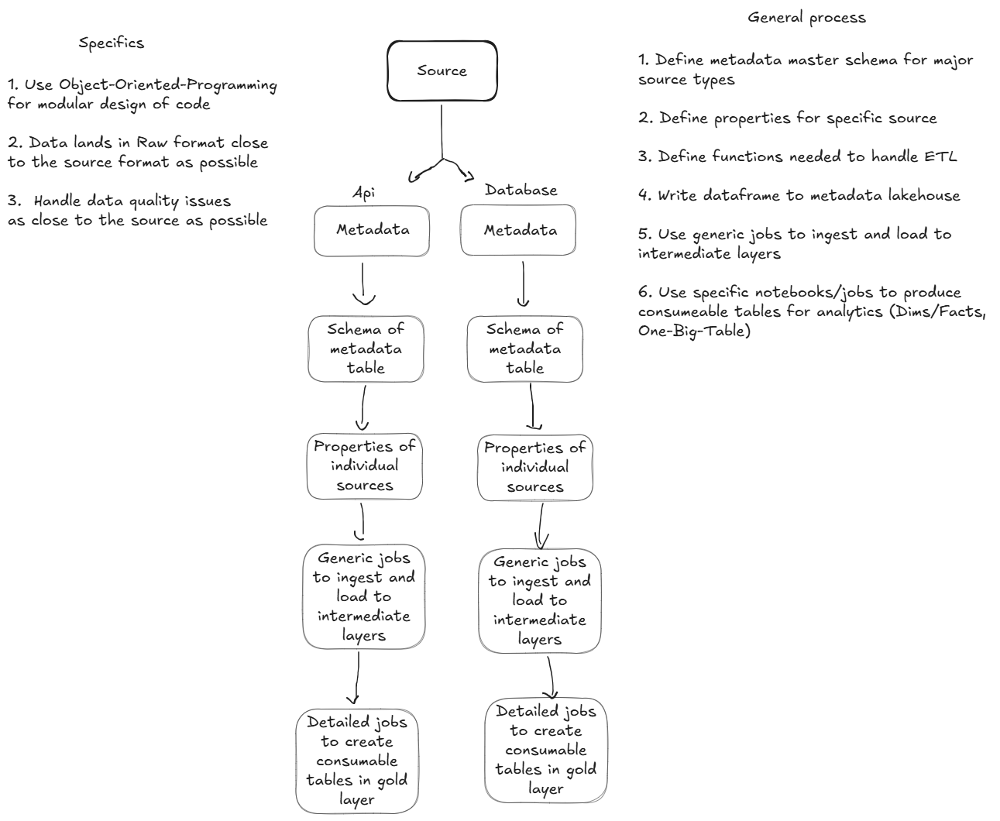

This repository covers learning to build a data platform

# Onboarding and data acquisition strategy

My strategy to onboard new data sources is to identify the type of source system it comes from which might make it possible to group it among others. 

For example i have found that APIs can serve their own configurations file, the same goes for server/database connections. A third one might be flat files which have their own quirks. 

To sketch it up generally we might put it like this where you can imagine more groups of source systems getting added on to process here. 

Let's look at an example. When we work with flat files, what might be needed of information to move these through the ELT process. First of all the files might come in different formats like Excel, csv, json, parquet and so on so there is a file format setting that applies to each. Then there is the path of where the data is located and the table name the file have and what it needs to have when we process it to the next zone. 
